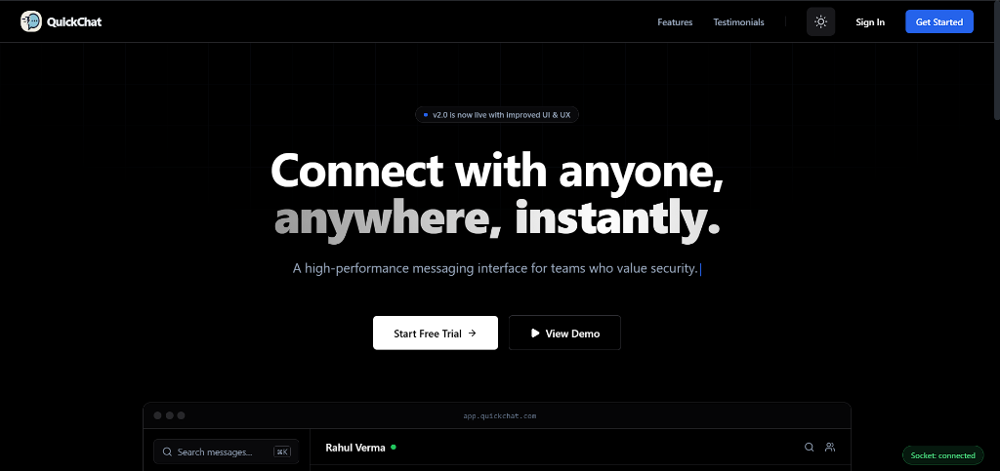

# 💬 QuickChat - Real-Time Messaging Platform

<div align="center">




**A modern, high-performance real-time chat application with OLED-optimized dark theme**

[🌐 Live Demo](https://quickchat-app-woad.vercel.app) • [📚 Documentation](#-features) • [🐛 Report Bug](https://github.com/sameeeerjadhav/quickchat-app/issues)

</div>

---

## ✨ Features

### 💬 **Real-Time Messaging**
- **Instant delivery** powered by Socket.io WebSocket connections
- **Typing indicators** - See when friends are composing messages
- **Read receipts** - Know when your messages have been seen
- **Message reactions** - React to messages with emojis
- **Smart polling fallback** - Automatic failover when WebSocket is unavailable

### 🎨 **OLED-Optimized Dark Theme**
- **Pure black (#000000) background** for true OLED displays
- **Battery-efficient** - Black pixels completely off on OLED screens
- **High contrast** zinc color system for optimal readability
- **Smooth theme toggle** between light and dark modes
- **System preference detection** - Auto-matches your OS theme

### 👥 **Friends System**
- Send and receive friend requests
- Manage your friend connections
- Real-time online/offline status indicators
- Green pulsing dot for online friends
- Last seen timestamps for offline users

### 📁 **Media & File Sharing**
- 🎤 **Voice messages** with recording interface
- 📷 **Image sharing** with preview
- 🎥 **Video file support**
- 📄 **Document uploads**
- File type detection and icons

### ⚡ **Performance Optimized**
- **60fps** throttled animations for smooth scrolling
- **React.memo** optimization on frequently re-rendering components
- **Reduced polling intervals** - Smart data fetching
- **Optimized socket reconnection** strategy
- **Lazy loading** for images and media
- **Skeleton loaders** for better perceived performance

### 📱 **Fully Responsive**
- **Mobile-first design** optimized for all screen sizes
- **Touch-friendly** interface with proper tap targets
- **Adaptive layouts** for tablets and desktops
- **Bottom navigation** on mobile devices
- **Swipe gestures** for enhanced mobile UX

### 🔒 **Security & Authentication**
- **JWT-based authentication** with secure token storage
- **Password hashing** with bcrypt
- **Protected API routes** with middleware
- **CORS configuration** for cross-origin requests
- **Environment variable** security

---

## 🛠️ Tech Stack

### Frontend
- **Framework:** Next.js 14.2 (App Router)
- **Language:** TypeScript 5
- **Styling:** Tailwind CSS 3.4
- **UI Components:** Custom components with Framer Motion
- **Icons:** React Icons (Feather, Hero Icons)
- **Real-time:** Socket.io Client 4.8
- **HTTP Client:** Axios
- **Theme:** next-themes for dark mode

### Backend
- **Runtime:** Node.js 20
- **Framework:** Express.js 4.21
- **WebSocket:** Socket.io 4.8
- **Database:** MongoDB with Mongoose
- **Authentication:** JWT (jsonwebtoken)
- **File Upload:** Multer
- **Security:** bcryptjs, CORS, helmet

### Database & Deployment
- **Database:** MongoDB Atlas (Cloud)
- **Frontend Hosting:** Vercel
- **Backend Hosting:** Render
- **Storage:** Local/Cloud (configurable)

---

## 🚀 Quick Start

### Prerequisites
- Node.js 18+ installed
- MongoDB Atlas account (or local MongoDB)
- Git installed

### 1. Clone the Repository
```bash
git clone https://github.com/sameeeerjadhav/quickchat-app.git
cd quickchat-app
```

### 2. Backend Setup

```bash
cd backend
npm install
```

Create `.env` file in `backend/` directory:
```env
# Database
MONGODB_URI=your_mongodb_atlas_uri
DB_NAME=quickchat

# Authentication
JWT_SECRET=your_super_secret_jwt_key_here

# Server
PORT=5000
NODE_ENV=development

# Frontend URL (for CORS)
FRONTEND_URL=http://localhost:3000

# File Upload (optional)
MAX_FILE_SIZE=10485760
UPLOAD_DIR=uploads
```

Start the backend server:
```bash
npm run dev
```

Backend will run on `http://localhost:5000`

### 3. Frontend Setup

```bash
cd ../frontend
npm install
```

Create `.env.local` file in `frontend/` directory:
```env
# API URLs
NEXT_PUBLIC_API_URL=http://localhost:5000
NEXT_PUBLIC_SOCKET_URL=http://localhost:5000

# App Configuration
NEXT_PUBLIC_APP_NAME=QuickChat
NEXT_PUBLIC_APP_URL=http://localhost:3000
```

Start the development server:
```bash
npm run dev
```

Frontend will run on `http://localhost:3000`

### 4. Access the App

Open your browser and navigate to:
```
http://localhost:3000
```

**Create an account** → **Add friends** → **Start chatting!**

---

## 📁 Project Structure

```
quickchat-app/
├── frontend/                    # Next.js application
│   ├── app/
│   │   ├── chat/               # Chat interface
│   │   ├── friends/            # Friends management
│   │   ├── settings/           # User settings
│   │   ├── components/         # Reusable components
│   │   ├── hooks/              # Custom React hooks
│   │   ├── context/            # React context providers
│   │   └── globals.css         # Global styles
│   ├── types/                  # TypeScript type definitions
│   ├── utils/                  # Utility functions & API
│   └── public/                 # Static assets
│
├── backend/                     # Express.js API
│   ├── controllers/            # Route controllers
│   ├── models/                 # MongoDB models
│   ├── routes/                 # API routes
│   ├── middleware/             # Auth & error handling
│   ├── socket/                 # Socket.io handlers
│   └── server.js               # Entry point
│
└── screenshots/                # App screenshots
```

---

## 🎯 Key Features in Detail

### Real-Time Communication
QuickChat uses **Socket.io** for bidirectional event-based communication:
- **Connection management** with automatic reconnection
- **Room-based messaging** for efficient delivery
- **Event handling** for typing, status, and messages
- **Fallback polling** when WebSocket unavailable

### OLED Theme Optimization
- Pure `#000000` backgrounds save battery on OLED/AMOLED displays
- Zinc color palette (`zinc-50` to `zinc-950`) for subtle contrast
- Smooth transitions between light and dark modes
- CSS custom properties for dynamic theming

### Performance Optimizations
- **Throttled events** (60fps max) for smooth animations
- **Memoized components** prevent unnecessary re-renders
- **Debounced API calls** reduce server load
- **Code splitting** for faster initial load
- **Image optimization** with Next.js Image component

---

## 🚢 Deployment

### Frontend Deployment (Vercel)

1. **Push your code to GitHub**
2. **Import project to Vercel**
3. **Configure environment variables:**
   ```env
   NEXT_PUBLIC_API_URL=https://your-backend.onrender.com
   NEXT_PUBLIC_SOCKET_URL=https://your-backend.onrender.com
   ```
4. **Deploy!** Vercel auto-deploys on push to main

### Backend Deployment (Render)

1. **Create new Web Service on Render**
2. **Connect your GitHub repository**
3. **Configure build command:** `npm install`
4. **Configure start command:** `npm start`
5. **Add environment variables** from `.env` file
6. **Deploy!**

### Database Setup (MongoDB Atlas)

1. **Create MongoDB Atlas account**
2. **Create new cluster** (free tier available)
3. **Create database user** with password
4. **Whitelist IP** (0.0.0.0/0 for development)
5. **Get connection string** and add to backend `.env`

---

## 🔧 Configuration

### Socket.io Configuration
```javascript
// Optimized reconnection settings
reconnectionDelay: 1000,      // Desktop: 1s, Mobile: 2s
reconnectionDelayMax: 5000,   // Desktop: 5s, Mobile: 10s
reconnectionAttempts: 20,     // Desktop: 20, Mobile: 10
timeout: 10000
```

### Polling Intervals
```javascript
User updates: 60,000ms   // 1 minute
Message fallback: 15,000ms   // 15 seconds
```

---

## 📱 Responsive Breakpoints

- **Mobile:** < 768px
- **Tablet:** 768px - 1024px
- **Desktop:** > 1024px

---

## 🎨 Color Scheme

### Light Mode
- **Background:** White (`#FFFFFF`)
- **Text:** Slate-900 (`#0f172a`)
- **Accent:** Blue-600 (`#2563eb`)

### OLED Dark Mode
- **Background:** Pure Black (`#000000`)
- **Text:** White (`#FFFFFF`)
- **Accents:** Zinc palette + Blue-400 (`#60a5fa`)
- **Status Online:** Green-500 (`#22c55e`)
- **Status Offline:** Zinc-600 (`#52525b`)

---

## 🧪 Testing

```bash
# Frontend tests
cd frontend
npm test

# Backend tests  
cd backend
npm test

# E2E tests
npm run cypress
```

---

## 🤝 Contributing

Contributions are welcome! Please follow these steps:

1. **Fork the repository**
2. **Create a feature branch** (`git checkout -b feature/amazing-feature`)
3. **Commit your changes** (`git commit -m 'Add amazing feature'`)
4. **Push to the branch** (`git push origin feature/amazing-feature`)
5. **Open a Pull Request**

---

## 📝 License

This project is licensed under the **MIT License** - see the [LICENSE](LICENSE) file for details.

---

## 👨‍💻 Author

<div align="center">

**Sameer Jadhav**

[](https://github.com/sameeeerjadhav)
[](https://www.linkedin.com/in/sameer-jadhav-a040921b5/)

</div>

---

## 🙏 Acknowledgments

- Icons from [React Icons](https://react-icons.github.io/react-icons/)
- UI inspiration from modern chat applications
- Socket.io for real-time communication
- Next.js team for the amazing framework

---

<div align="center">

### ⭐ Star this repo if you find it useful!

### 🐛 Found a bug? [Open an issue](https://github.com/sameeeerjadhav/quickchat-app/issues)

### 💡 Have a suggestion? [Create a PR](https://github.com/sameeeerjadhav/quickchat-app/pulls)

**Made with ❤️ by Sameer Jadhav**

</div>
